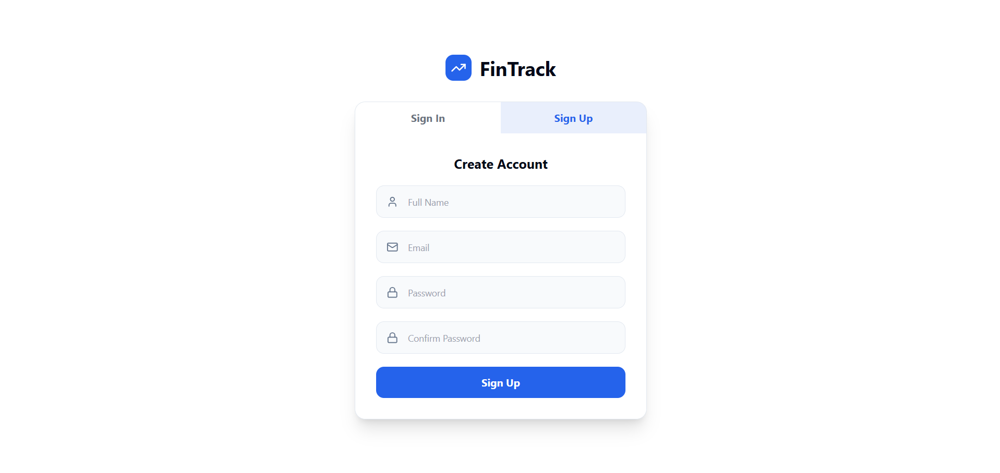
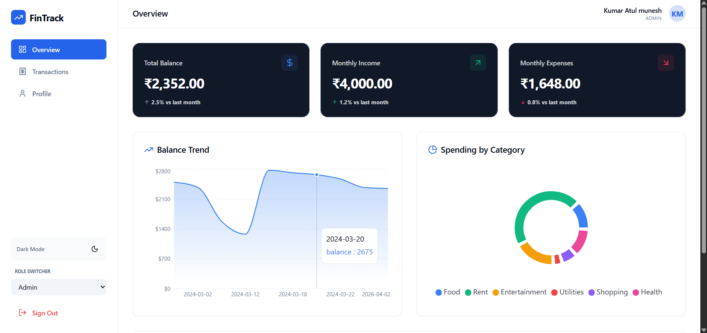

# 💰 Finance Dashboard UI

## 📌 Project Overview

The **Finance Dashboard UI** is a frontend project designed to showcase skills in UI development, component structuring, and state management.

This application allows users to:

* Track financial data
* View summaries of income and expenses
* Analyze spending patterns
* Interact with a role-based interface (Viewer / Admin)

> ⚠️ Note: This project uses mock data and does not require any backend.

---

## 🚀 Live Demo (Optional)

👉 Add your deployed link here
Example: https://finance-dashboard.vercel.app

---

## 📸 Screenshots (Optional)





---

## ✨ Features

### 📊 Dashboard Overview

* Total Balance card
* Total Income card
* Total Expenses card
* Time-based chart (balance trend)
* Category-based chart (expense breakdown)

---

### 💳 Transactions Section

* Displays:

  * Date
  * Amount
  * Category
  * Type (Income / Expense)
* Functionalities:

  * Search
  * Filter
  * Sorting
* Handles:

  * Empty data state

---

### 🔐 Role-Based UI (Frontend Simulation)

#### 👀 Viewer Role

* Can only view data
* Cannot add or edit transactions

#### ⚙️ Admin Role

* Can add new transactions
* Can manage data

#### 🔄 Role Switching

* Dropdown toggle to switch roles dynamically

---

### 🧠 Insights Section

* Highest spending category
* Basic financial insights
* Monthly comparison (if implemented)

---

## 🛠️ Tech Stack

* **Frontend:** React.js
* **State Management:** Context API
* **Styling:** CSS / Tailwind CSS
* **Charts:** Chart.js / Recharts (optional)

---

## 📁 Project Structure

```id="code1"
finance-dashboard/
│
├── public/
│   └── index.html
│
├── src/
│   ├── components/
│   │   ├── Dashboard/
│   │   ├── Transactions/
│   │   ├── Insights/
│   │   └── Common/
│   │
│   ├── context/
│   │   └── AppContext.jsx
│   │
│   ├── data/
│   │   └── mockData.js
│   │
│   ├── pages/
│   │   └── Home.jsx
│   │
│   ├── styles/
│   │   └── global.css
│   │
│   ├── App.jsx
│   └── main.jsx
│
├── package.json
└── README.md
```

---

## ⚙️ Installation & Setup

### 1️⃣ Clone Repository

```id="code2"
git clone https://github.com/your-username/finance-dashboard.git
```

### 2️⃣ Navigate to Project

```id="code3"
cd finance-dashboard
```

### 3️⃣ Install Dependencies

```id="code4"
npm install
```

### 4️⃣ Run Project

```id="code5"
npm run dev
```

---

## 🔄 State Management

The application uses **React Context API** to manage:

* Transactions data
* User role (Admin / Viewer)
* Filters and UI states

---

## 🎯 Core Concepts Implemented

* Component-based architecture
* Conditional rendering (Role-based UI)
* Data handling using mock data
* Clean UI/UX design
* Responsive layout

---

## 📱 Responsiveness

* Fully responsive design
* Works on:

  * Desktop 💻
  * Tablet 📱
  * Mobile 📲

---

## 🧪 Edge Cases Handled

* No transactions available
* Empty search results
* Role restrictions (Viewer cannot modify data)

---

## 🌟 Optional Features (If Added)

* Dark mode 🌙
* Local storage persistence
* Animations & transitions
* Export data (CSV/JSON)
* Advanced filtering

---

## 🧾 Assumptions

* No backend integration required
* Data is static/mock
* Role-based logic is simulated on frontend only

---

## 👨‍💻 Author

****

---

## 📌 Final Note

This project is built for evaluation purposes to demonstrate:

* Frontend development skills
* UI/UX thinking
* State management approach
* Problem-solving ability

---
